# Working Critically with AI Coding Tools

*Workshop Tutorial by Mary Chester-Kadwell (2026)*

> Aims:
>
> - To explore and understand the basic foundations of AI coding tools so that you are better equipped to work with them critically
> - To apply AI coding tools critically to a range of research software engineering tasks

# Table of Contents

1. [Table of Contents](#table-of-contents)

2. [Models, Inference Providers, AI Coding Tools](#models-inference-providers-ai-coding-tools)

- 1. [Get API Key](#get-api-key)

- 2. [Set up Repo](#set-up-repo)

- 3. [Explore AI Coding Tool Extensions](#explore-ai-coding-tool-extensions)

- 4. [Security](#security)

3. [Models, Modes and Thinking](#models-modes-and-thinking)

- 1. [Set up Cline](#set-up-cline)

- 2. [Modes: Plan and Act](#modes-plan-and-act)

- 3. [Thinking](#thinking)

4. [Tool Calls and Permissions](#tool-calls-and-permissions)

- 1. [Set up OpenCode](#set-up-opencode)

- 2. [Permissions for Tool Calls](#permissions-for-tool-calls)

5. [Agentic Coding](#agentic-coding)

- 1. [AGENTS.md](#agentsmd)

- 2. [Git Commit](#git-commit)

- 3. [Document Existing Code](#document-existing-code)

6. [Vibe Coding and Validation](#vibe-coding-and-validation)

<!-- -->

7. [Notes for Helpers](#notes-for-helpers)

- 1. [How to get Cline to show commands and ask permissions](#how-to-get-cline-to-show-commands-and-ask-permissions)

- 2. [How to open OpenCode on the command line with API key](#how-to-open-opencode-on-the-command-line-with-api-key)

- 3. [Correct requirements.txt](#correct-requirementstxt)

- 4. [How to open the repo in GitHub Codespaces](#how-to-open-the-repo-in-github-codespaces)

------------------------------------------------------------------------

# Models, Inference Providers, AI Coding Tools

> Goals:
>
> - Learn the difference between models, inference providers and AI coding tools
> - Consider basic safety principles when working with AI coding tools

## Get API Key

1.  Log into OpenRouter <https://openrouter.ai/>. You should already have an account from completing the pre-workshop preparation.
2.  Get an API key from OpenRouter <https://openrouter.ai/workspaces/default/keys>

<!-- -->

- 1. Click **+ New Key** button
- 2.  Set “Expiration” for 1 day in the dialog and click **Create**.  

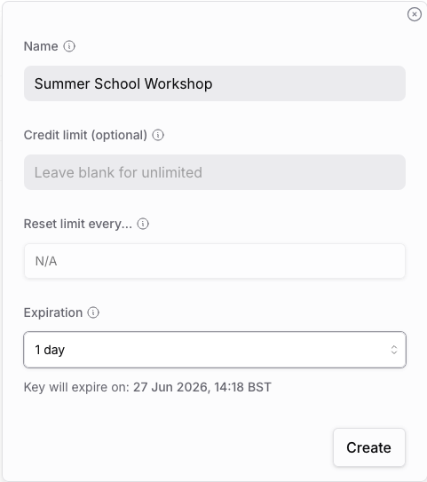

3.  Leave the page open. There is no need to copy and paste this anywhere for the moment.

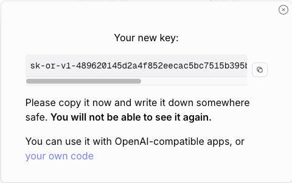

3.  Explore the different models available on OpenRouter

<!-- -->

- 1.  <https://openrouter.ai/models>
- 2.  <https://openrouter.ai/rankings?category=programming#categories> 
- 3.  Make a note of the ones that are open source, free and designed for coding.

## Set up Repo

1.  Log into GitHub and go to <https://github.com/DH-RSE-Summer-School/kdl-ai-coding-tools-2026> 
2.  Fork the repo into your own account. The “Owner” should be your account.

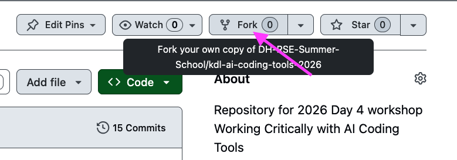

  
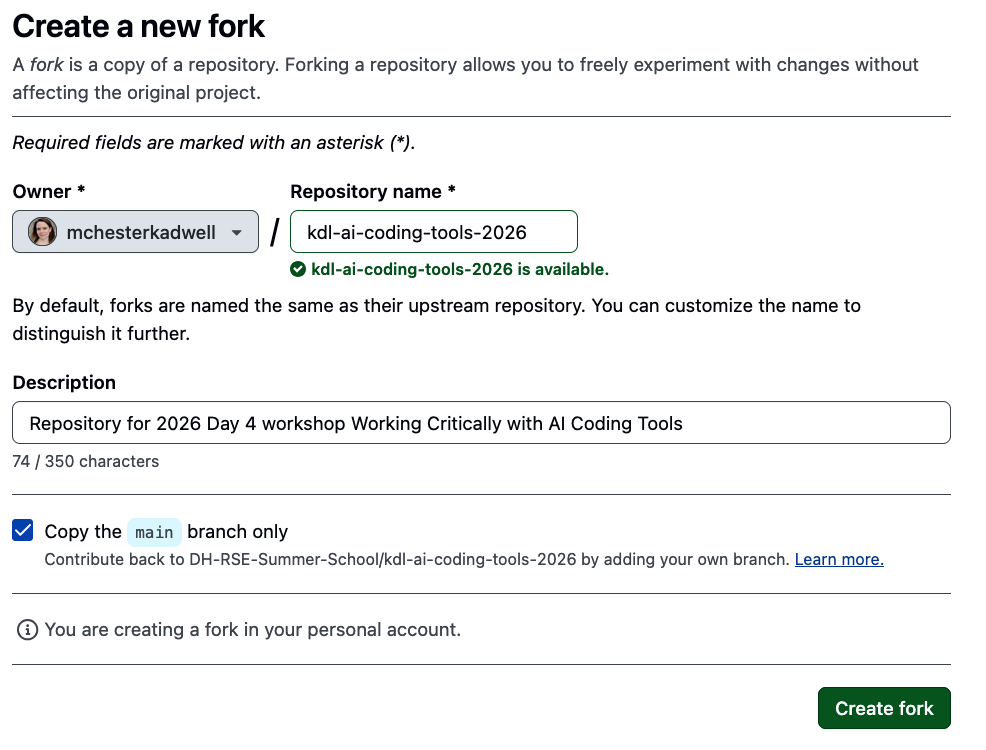  

3.  Open VSCode
4.  Open the **Command Palette** (⇧⌘P or ⇧Ctrl P)
5.  Type “git clone” to bring up the Git: Clone command and press Return to accept.

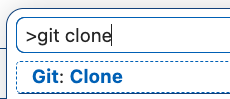  

6.  Copy and paste your forked repository URL e.g. https://github.com/youraccount/kdl-ai-coding-tools-2026

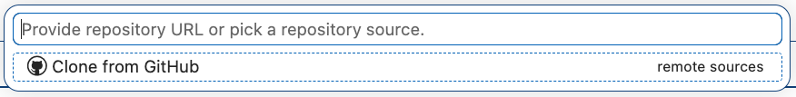

7.  If required, follow the GitHub authentication steps.
8.  You should get a notification about the Dev Container configuration file. Click the button **Reopen in Container**.

- If you do not get a notification, open the Command Palette and search for “reopen” to find the command.

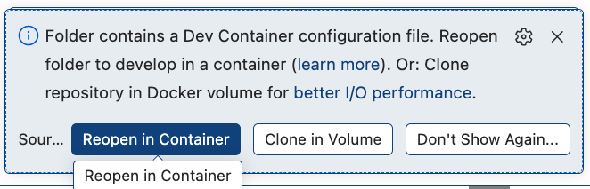

## Explore AI Coding Tool Extensions

1.  Get familiar with the VSCode interface and all the AI coding tool extensions that are installed - from left to right:

- Claude chat
- Cline chat
- Continue chat
- Claude Code TUI
- OpenCode TUI
- Copilot chat (built-in)  

> Do not worry if it seems overwhelming at first! We will not be using all these extensions at once! We will use Cline and OpenCode. You can experiment with the others yourself after the workshop.

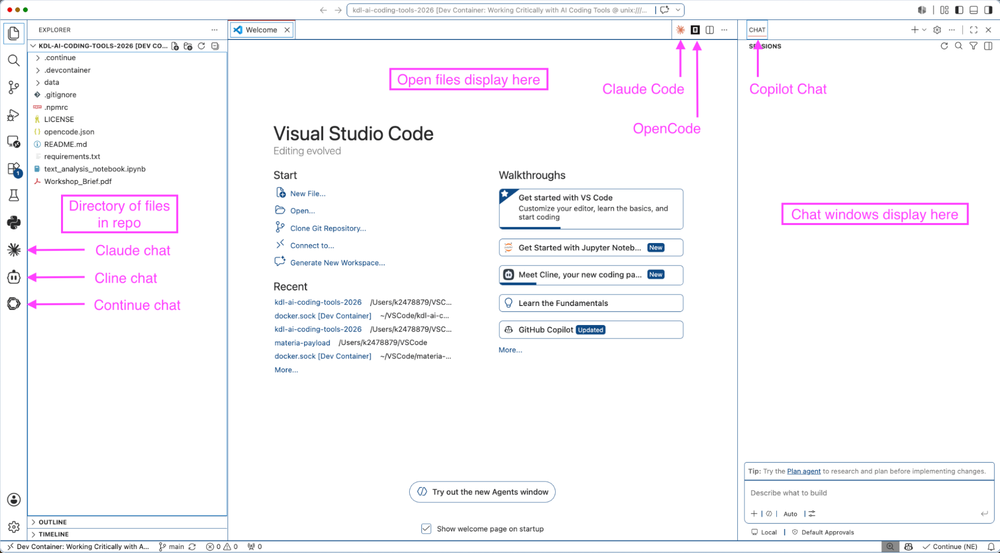

2.  Arrange the AI coding tools: Grab the **Cline** icon from the left-hand side and drag it over to just next to the word **CHAT** in the window on the right-hand side. It should now look like this:

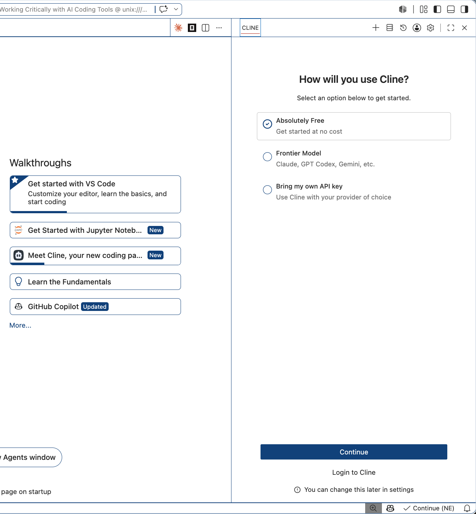

I will demonstrate with Cline with the OpenRouter free models at first and then switch to OpenCode with OpenCode Zen free models.

## Security

Before we go further we should discuss some important security matters that are often overlooked.

> Explanation and discussion.

**Why are we using Docker and Dev Containers to run the project?**

AI coding agents can read and write to any files they can access. Containers provide an isolated environment from the rest of your machine. Agents can only see the files in this repository and not the rest of your machine. This helps protect you from agents going wrong and accessing files you do not want them to touch.

Isolated container environments also help limit the damage that can be done by malicious external parties. For example:

- Prompt injection in text that the agent may parse from an internet search or in a package dependency;
- Malicious code in packages and IDE extensions.

Using a Dev Container also means I can share a complex setup with all of you without any manual installations. In general, containers are a great way to share your code for maximum reproducibility too.

**Handling API keys more safely**

Your API keys provide access to your resources and if a malicious external party gets hold of them they can use them freely with whatever permissions they have. If you are paying for these resources, then the malicious actor will be able to spend your money too!

Follow these basic tips to handle API keys more safely:

- API keys should be created with time limits, in order to limit the damage if someone gets hold of your key. We did this earlier.
- Avoid putting plain text API keys in files in your repository. You might accidentally commit and push them to GitHub where someone will immediately find and use them.
- If you need to pass an API key on the command line, there are safer ways to do it that will not end up in your command history where it could be easily exfiltrated by a malicious actor.

# Models, Modes and Thinking

> Goals:
>
> - Explore the differences between models and between modes (e.g. chat, plan, agent/act/build)
> - Understand the basics of what is meant by model “thinking”

## Set up Cline

Cline is a chat-style extension. Go back to the Cline chat window that you set up earlier.

1.  Pick the “Bring my own API key” option and click **Continue**.

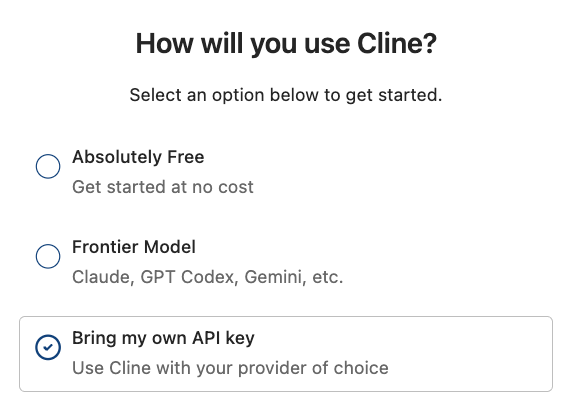

2.  Configure your provider as follows:

- 1.  **API Provider**: OpenRouter
- 2.  **OpenRouter API key**: Copy and paste the API key you created earlier.
- 3.  Explore the possible inference providers under Model. Try typing “free” to search for free models. Scroll down the list. What providers do you recognise from earlier?

4.  Configure the Model:
- 1.  Pick “Poolside Laguna M.1 (free)”
- 2.  Enable thinking

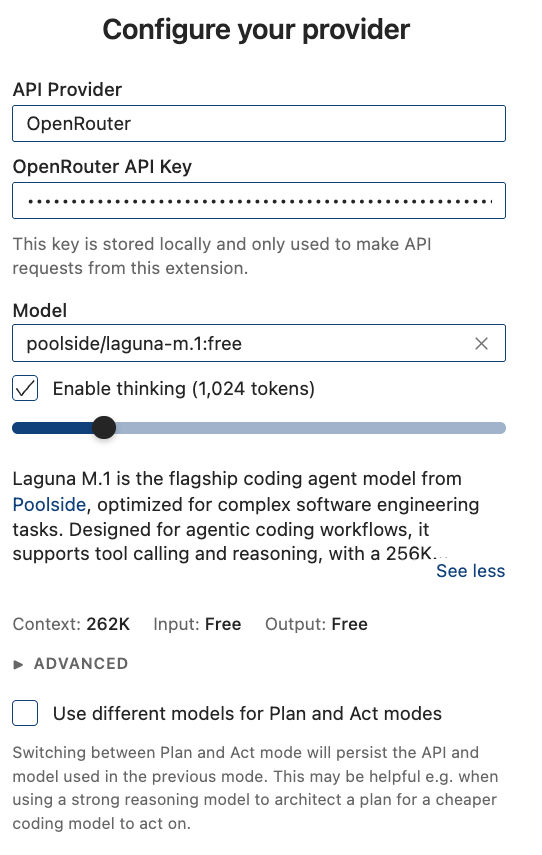

> Later on, you can switch to another model or “openrouter/free” if you get a rate limiting message like this:  

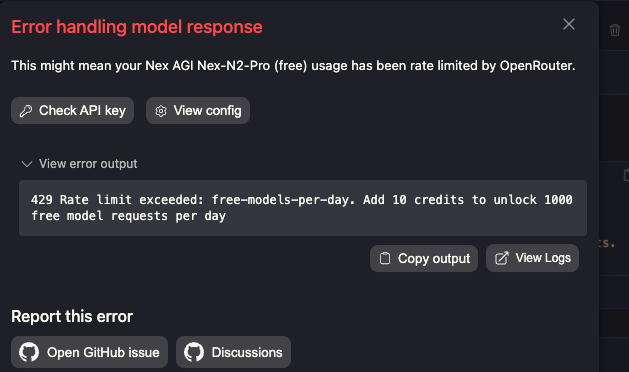

> If you have a ChatGPT Plus subscription you can log into Cline with it now. If you have a Claude Pro subscription you are welcome to log in to the Claude Code chat extension instead at this point. (Drag it from the left-hand bar to the right-hand chat area first.) However, if you don’t have any subscriptions, don’t worry. I will continue to demonstrate in Cline with OpenRouter and you can do the same.

## Modes: Plan and Act

AI coding tools have different ‘modes’ such as Plan and Edit/Build/Act/Agent. There are slight differences in terminologies and capabilities between tools.

Generally speaking, Plan is for working out a complex plan in advance without changing anything. Edit/Build/Act/Agent is for acting immediately or implementing a plan, either with or without your direct supervision. Coding tools can also spawn multiple agents in parallel that act by themselves without your direct supervision, but we will not be covering that in this tutorial.

> NB: It is strongly recommended you “Start New Task” before each query in Cline for the best results. This is because Cline adds all the previous context to each task, which can be slow with free models and quickly exhaust your free model limits.

1. Try some very simple queries in Act mode in Cline (or think of your own):

- What is the license for this repository and what does it mean?
- Tell me about this repository
- What does the Jupyter notebook do?
- Tell me about this line of code (with a line of code highlighted in the IDE)

> NB: If you are using Claude Code chat extension, then use “Ask before edits” mode.

Here Cline can help you understand code and act as a tutor if you don’t understand something.

2. Repeat the same queries with some different (free) models or “openrouter/free”:

- How do models differ?

During your experimentation:

- Notice what steps Cline is taking to complete your query.
- Try adding some context with @
- Have you noticed any error messages?

## Thinking

1. Try looking at what Cline is saying under “Thinking” (or the Claude equivalent). What do you think this text represents?

> Explanation and discussion.

# Tool Calls and Permissions

> Goals:
>
> - Understand that the basic foundation on which the coding tools interact with a codebase is using command line commands via tool calls
> - Consider how to balance convenience vs safety in giving permissions to coding tools

## Set up OpenCode

OpenCode is a TUI, which stands for Terminal User Interface. There are a number of these, including Claude Code (perhaps the most famous), Codex CLI and Kiro.

We are going to switch to OpenCode for the rest of the tutorial because it has free models that integrate with it well and have more generous limits. It will be able to carry out more complex tasks with fewer issues.

> If you are a Claude Pro subscriber you have the option to open the Claude Code TUI instead. Codex CLI is not supported for this workshop.

1.  Open OpenCode using the OpenCode button in the top-right of the VSCode window.

- 1.  You may find it more convenient to close the Cline chat at this point in order to save screen space. It can be reopened later in the menu bar View \> Appearance \> Secondary Side Bar.

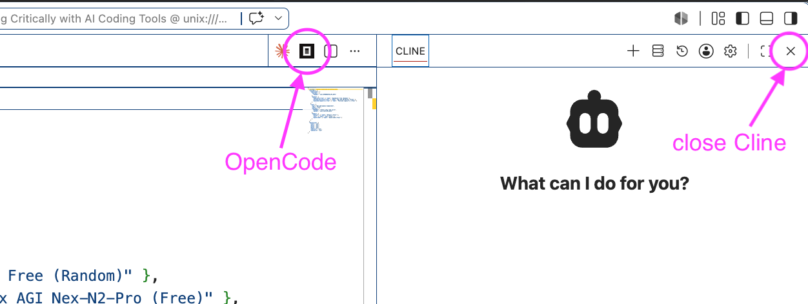

You should now see something like this:

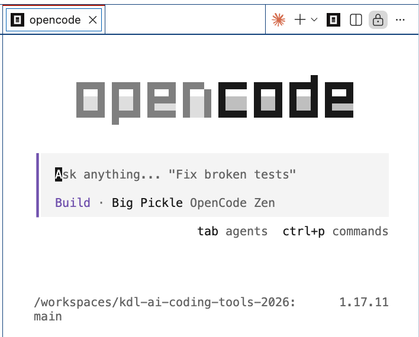

Using a TUI is a little different than a chat GUI, but we will walk through it and you will soon find it easier if you have not used a TUI before.

2.  Try switching between Plan and Build with the **Tab** key
3.  Type **/connect** and press **Return**  

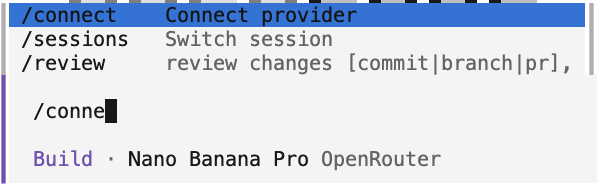  

4.  Type “openrouter” and press **Return**

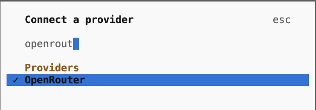

5.  Paste in your API key and press **Return**

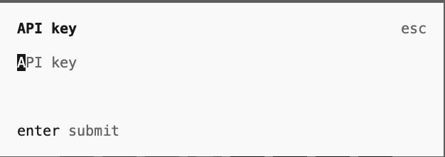

6.  Press **Escape** to return to the main prompt
7.  Type **/models** and press Return

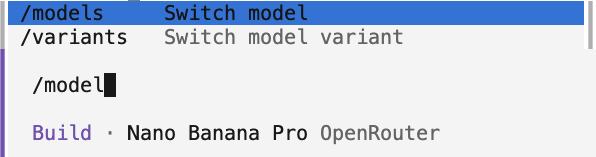

8.  Good models to try are (search by typing the name):

- North Mini Code Free (OpenCode Zen)
- DeepSeek V4 Flash Free (OpenCode Zen)
- Big Pickle (OpenCode Zen)

Tip: Go up and down in the menu with the **arrow keys**.

OpenRouter models are also available but the models above are better.

9.  If you are asked to pick a variant, press return to accept Default

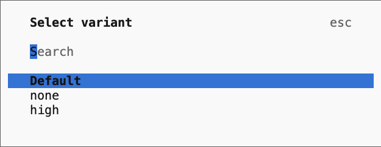

## Permissions for Tool Calls

1. Escape to the main prompt and make sure you are in Plan mode by pressing tab until Plan appears. 
2. Try some queries in Plan mode that will trigger the use of the command line:

- Tell me about the state of version control in this repo.
- Who has contributed the most commits to this repo?
- What version of Node.js and Python am I running?
- What VSCode extensions do I have installed?
- How many lines of code are in this project, broken down by file type?

3. Each time OpenCode wants to use the command line, it gives you the option to **Allow** or **Reject** the request. Click **Allow once** for the moment each time.

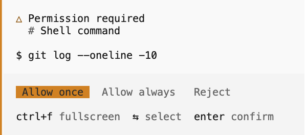

Click on **Thinking** with the mouse to see what the model is “thinking”:  

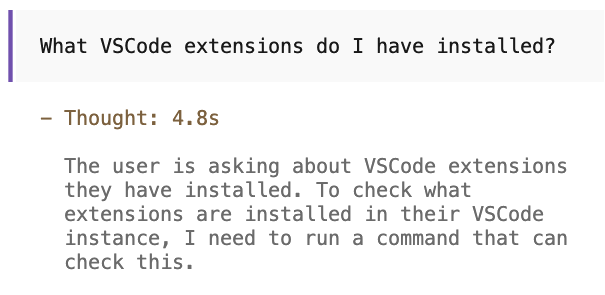

> Explanation and discussion.
>
> Discussion points:
>
> - Do you understand these commands? Do you recognise any of them from Monday’s command line teaching or Wednesday's version control teaching?
> - How comfortable are you about approving commands you don’t understand or allowing the agent to run without oversight?

# Agentic Coding

Before we start to do some ‘real work’, let’s set up the repo to follow some of the best practices that you learnt in Wednesday's Sustainable Software Practices session.

1.  First, switch to Build mode by pressing tab.

## AGENTS.md

> Goal:
>
> - Understand and create an AGENTS.md file, which is a form of documentation for coding agents (like README.md is for humans)

AGENTS.md is a briefing for a coding agent working on this project. It tells the agent what the project is, what the conventions are, and what not to do. It travels with the repository, not with you.

2. Try the following prompt:

- Create a brief AGENTS.md that tells agents this is a teaching repo and not to fix stuff without being explicitly asked to. Also, the AI use policy is that AI assistance is expected and the precise model used must be named in the commit message body. Give an example of a good commit message in Conventional Commits format to follow. Make sure you read the AGENTS.md yourself before you commit this change.

After you have reviewed the tool call permissions being asked for, click **Allow always** for each type and **Confirm**.

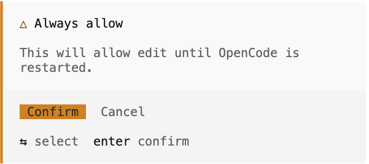

3.  Review the content it has created.
4.  Now ask it to review its own AGENTS.md in light of the recommendations made here and verify if it is following them correctly: <https://asdlc.io/practices/agents-md-spec/>.
5.  Review the content it has created and ask it to make any corrections you wish.

> Explanation and discussion, including acknowledging AI coding assistance.
>
> Discussion points:
>
> - What kind of thing is supposed to go in AGENTS.md? Why?
> - What is recommended not to go in AGENTS.md?
> - Do we still need README.md anymore?
> - Why are we adding an AI use policy?
> - Why are we asking it to put a model in the commit message? What format did it suggest this should take? What issues might there be with these forms of acknowledgement?

## Git Commit

> Goal:
>
> - Learn to delegate version control tasks to a coding agent

The coding tools know `git` commands inside and out. They will write much better commit messages than you likely could, so let them write your git commits for you.

1.  Ask OpenCode to commit AGENTS.md with a suitable message.
2.  Before you Accept, review the git commit message:

- 1.  Did it follow the instructions in AGENTS.md?
- 2.  If not, Reject the action and give it a new prompt to try and fix it.

> Explanation and discussion.
>
> Discussion points:
>
> - Is it easier to use version control with an agent?
> - Do you understand what it is doing?
> - What are the benefits and drawbacks of having an agent do all the version control for you?

3.  Now you can go to the Source Code tab in VSCode and Sync your changes with your GitHub repo.

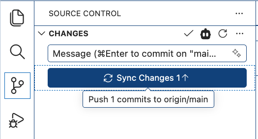

## Document Existing Code

> Goal:
>
> - Learn how AI coding agents can help you with software sustainability

Now we are going to do something a bit more complicated and get the agent to complete some sustainability tasks for us.

1.  First, make sure you are in Build mode.
2.  If you are not already using DeepSeek V4 Flash Free, I recommend you switch to this model (type /models).

The repo already contains code from a sustainability exercise. Note in particular the Jupyter notebook `text_analysis_notebook.ipynb`. Plus a list of sustainability tasks to complete in `Workshop_Brief.pdf` (originally from this workshop: <https://github.com/DH-RSE-Summer-School/DH-RSE-Summer-School-2024/blob/main/day%202/Workshop_Brief.pdf>)

3.  Prompt OpenCode to complete all the tasks under the heading “Tasks: Documentation” in `Workshop_Brief.pdf` and only those tasks.

Whenever OpenCode asks for permissions click **Always allow** until it stops asking.

4.  During this process observe:

- 1.  What commands does it use to get the job done?
- 2.  Did you allow any potentially destructive or problematic commands?
- 3.  What tasks are in the to-do list it creates? Do they match the PDF tasks?
- 4.  What steps does it take to complete each task?
- 5.  Does it verify that everything is correct?
- 6.  Does it correct its own mistakes?

5.  Review the files it has created. What files did it create?
6.  Run the Jupyter notebook to check it works:

- 1.  Open the Jupyter notebook.
- 2.  Click the **Run All** button to start execution.
- 3.  Under **Select Kernel** choose **Python Environments…**

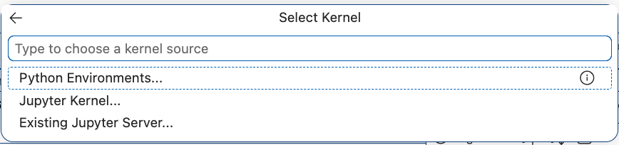

4.  Choose **Python 3.13** from the dropdown.

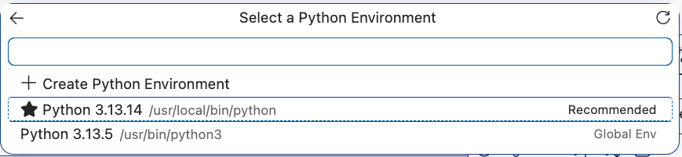

7.  Prompt OpenCode to fix any problems, pasting in any errors messages, if required.

> When making changes to dependencies etc. you will need to Restart the kernel. You can also do this from the Command Palette by typing “Jupyter restart kernel”.

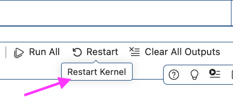

8.  Prompt OpenCode to add any relevant details to README.md or AGENTS.md.
9.  Commit and push the changes.

> Discussion points:
>
> - Was it helpful to get this documentation done with the agent?
> - What were the sticking points, if any?

## Vibe Coding and Validation

> Goals:
>
> - Direct an agent with Plan and Build modes to create software autonomously
> - Apply a basic method to validate code created by an AI coding tool without reviewing it yourself
> - Develop a basic understanding of the origins of intelligent agents

We will now attempt to get the agent to develop a multi-step software product with minimal human intervention.

1.  First, make sure you are in Plan mode.
2.  Here are 2 prompt options to try for different topics we have covered this week at the Summer School (pick whichever you prefer):

- 1.  **Prompt (HPC)**: "Make a plan for this: I want to create a command line script to run the analysis in the notebook on an arbitrary number of files and output an image for each. It should be written in such a way as it could be parallelised on a HPC. Write instructions for running it on SLURM too."
- 2.  **Prompt (data visualisation)**: "Make a plan for this: I want to create an interactive web interface that takes any text file and creates a visualisation of top words, like in the jupyter notebook."

3.  Open the Thinking and review it.
4.  To save time, answer any questions it has with the simplest case possible.
5.  Once it has finished its plan and is ready, switch to Build and direct it to implement the plan.

> You may still need to continue to give it tool call permissions as it works.

6.  After it has finished:

- 1.  Observe if it validated its own work or not.
- 2.  Ask it how you can verify its work yourself (i.e. how can you run it and see the results)
- 3.  Prompt it to fix any errors.

> While the agents works we will do some explanation and discussion.
>
> Discussion points:
>
> - Based on what you learned on Tuesday afternoon in the “LLM jargon and comparison practical”, what could be another way to validate the code?

------------------------------------------------------------------------

# Notes for Helpers

## How to get Cline to show commands and ask permissions

Open the Auto-Approve menu and uncheck “Edit project files” and “Execute safe commands”. This will make sure that you get asked before the agent does anything.

Go to the Cline settings and under the Terminal tab pick “Background exec” from the dropdown Terminal Execution Mode. This is so that the Terminal appears inline in the chat window and does not open a new terminal. Go to Features tab and turn off “Native Tool Call” so that Cline is forced to use the command line for more types of activities rather than specialised tools.

Start a new task for each of these queries for best results.

## How to open OpenCode on the command line with API key

```
read -s OPENROUTER_API_KEY && export OPENROUTER_API_KEY && opencode
```

## Correct requirements.txt

The correct requirements.txt should be something like but probably other ones will work too!

```
gensim>=4.3.0
nltk>=3.9.0
pandas>=2.0.0
spacy>=3.7.0
plotly>=5.18.0
nbformat>=4.2.0
ipywidgets>=8.0.0
```

## How to open the repo in GitHub Codespaces

- Go to repo page
- Go to the *Code* dropdown
- Pick Codespaces tab and click **Create codespace on main**

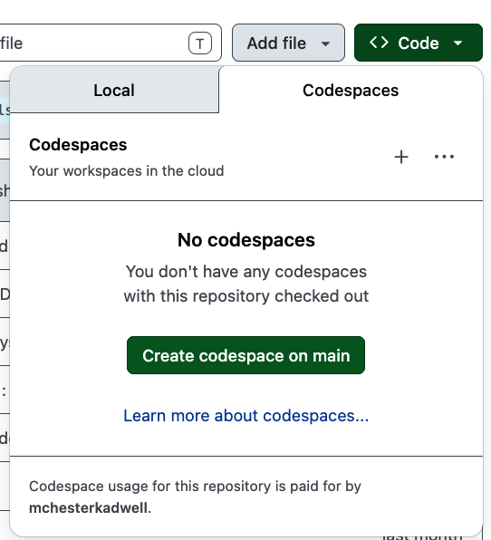

- Wait for it to load! That’s it!

This next step should not be necessary, but demonstrates how to pass secrets like API keys correctly from GitHub into Codespaces.

- Go to Settings \> Secrets and variables \> Codespaces

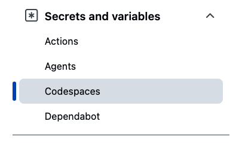

- Create a New repository secret

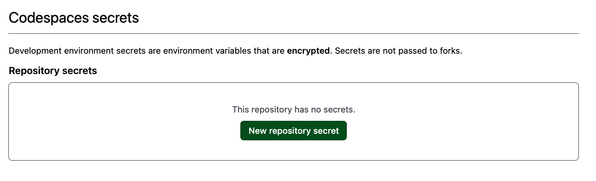

- Name: OPENROUTER_API_KEY and then paste the API key into Secret. Click Add secret.

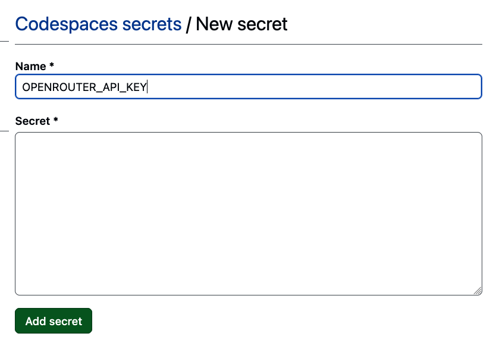

- Go back to the Codespaces and click Reload to apply

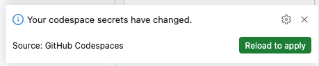
